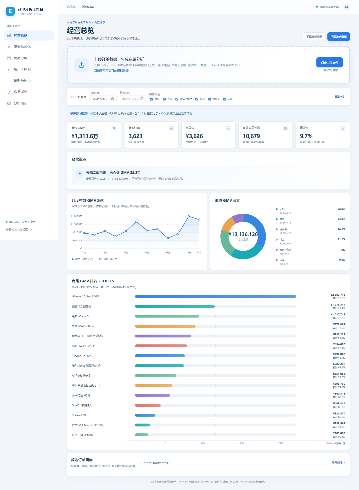
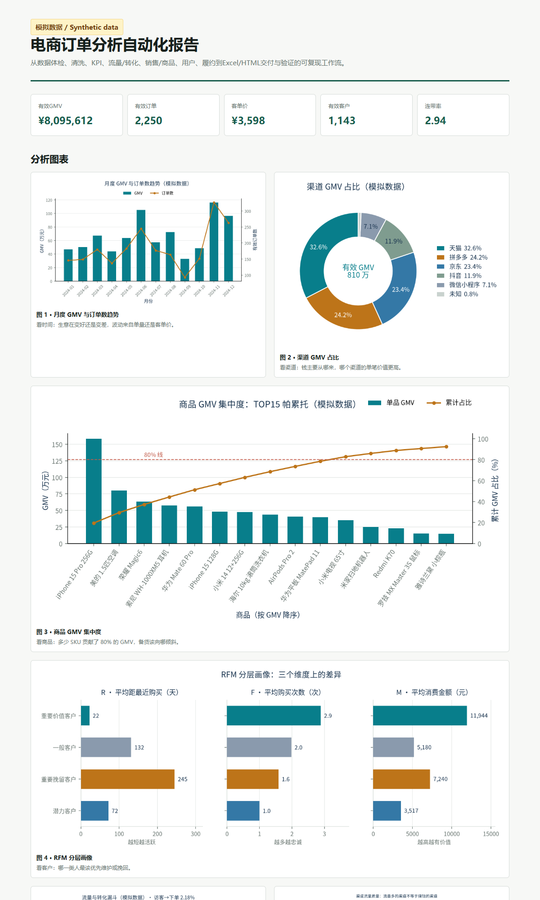

# 电商订单分析工作台

[](https://github.com/l-sd/ecommerce-analytics-agent/actions/workflows/ci.yml)
[](https://www.python.org/)
[](LICENSE)

一个可复现的电商订单分析工作台：从订单 CSV/Excel 中识别数据质量问题、标准化字段和金额口径，生成经营指标、分维度图表、Excel 工作簿、HTML 分析报告与校验记录。项目提供浏览器在线作品集、Streamlit 交互仪表盘和命令行批处理三种使用方式。

> **数据声明：** 仓库中的示例订单、流量和商品目录均为固定随机种子生成的模拟数据，不包含真实企业、客户或交易信息。示例分析结论只用于展示方法和流程，不能代表真实经营表现。

## 目录

- [在线体验与页面预览](#在线体验与页面预览)
- [产品功能](#产品功能)
- [选择使用方式](#选择使用方式)
- [快速开始](#快速开始)
- [上传文件格式](#上传文件格式)
- [指标口径与数据限制](#指标口径与数据限制)
- [分析产物](#分析产物)
- [测试与验证](#测试与验证)
- [项目结构](#项目结构)
- [隐私与安全](#隐私与安全)
- [许可证](#许可证)

## 在线体验与页面预览

**GitHub Pages 在线 Demo：** [https://l-sd.github.io/ecommerce-analytics-agent/](https://l-sd.github.io/ecommerce-analytics-agent/)（无需登录）





在线页面默认读取仓库中的模拟数据，也可以在“经营总览”页上传自己的 CSV/TSV 订单文件试用。浏览器版不会把文件发送到服务器。Excel 文件请先另存为 CSV UTF-8；在线版单个文件上限为 20 MB。模板：[docs/order-upload-template.csv](docs/order-upload-template.csv)。

## 产品功能

### 1. 数据导入、清洗与质量检查

- 读取 CSV 和 Excel 订单表；识别日期、金额、数量等常见格式。
- 检查重复订单、缺失或无法解析的日期/金额/数量、负数或零数量、金额与单价乘数量不一致、缺失维度等问题。
- 按项目既定规则标准化字段和状态，保留清洗记录，方便追溯数据变化。
- 提供订单明细模式与订单级平台导出模式。后者适用于没有商品、用户明细的公开平台导出，不会伪造缺失的商品或客户字段。

### 2. 交互式经营分析

GitHub Pages 版含七个分析页面。日期和渠道筛选会同步作用于相关结果；关键指标、图表、结论和数据说明按“先看结论，再看图表，最后查看明细”的顺序组织。

| 页面 | 主要内容 |
| --- | --- |
| 经营总览 | 有效 GMV、有效订单、客单价、商品件数、退款率、月份趋势、渠道占比、商品 GMV 排名与经营观察 |
| 渠道与转化 | 配套流量表中的曝光、访客、加购、下单漏斗；渠道 GMV 和转化表现 |
| 商品分析 | 品类和品牌 GMV、SKU 排名、商品目录动销率 |
| 用户 / RFM | 复购率、客均订单数、RFM 客户数与 GMV 分层、用户贡献集中度 |
| 退款与履约 | 全量订单退款率、退款原因、发货/签收时效、迟发与逾期情况 |
| 数据质量 | 重复、缺失和金额异常概览，数据可用性及指标定义 |
| 分析报告 | 汇总当前筛选条件下的 KPI、主要发现与数据限制 |

在线版支持点击或拖拽 CSV/TSV 文件、识别常见中英文表头、查看载入文件名、重新上传或恢复模拟数据，并下载筛选后的订单明细 CSV 和分析摘要 JSON。详细订单表和次要口径说明按需展开。

Streamlit 版使用同一套 Python 分析模块，提供六个工作流标签页：经营总览、流量转化、销售与商品、用户与 RFM、退款与履约、质量与口径。支持 CSV/XLSX 上传、日期和渠道筛选、图表交互及结果下载。运行方式见[本地启动 Streamlit](#启动-streamlit-仪表盘)。

### 3. 命令行分析与可交付报告

- 对订单明细或订单级导出执行完整分析流水线。
- 生成 Excel 工作簿、可离线打开的单文件 HTML 报告、PNG 图表、分析 JSON、清洗日志和验证记录。
- 在报告中说明指标计算方式、分母、输入字段是否可用及分析限制。

### 4. 可复现模拟数据

仓库包含两套独立的固定种子示例数据：

| 数据集 | 订单数据 | 配套数据 | 用途 |
| --- | --- | --- | --- |
| `data/` | 3,090 行原始订单，含 3,000 个唯一订单和 90 行重复记录 | 1,830 行流量表、50 行商品目录 | 命令行分析、测试与示例报告 |
| `data/portfolio_demo/` | 4,999 行原始订单，含 4,854 个唯一订单和 145 行重复记录 | 对应流量表和商品目录 | 在线作品集与 Streamlit 默认演示 |

两套数据均为合成数据。重新生成时可指定随机种子；相同种子与参数会生成相同数据。

## 选择使用方式

| 使用方式 | 适合场景 | 上传格式 |
| --- | --- | --- |
| [GitHub Pages 在线 Demo](https://l-sd.github.io/ecommerce-analytics-agent/) | 快速体验分析页面、用小型文件试用 | CSV/TSV，最大 20 MB，在浏览器本地解析 |
| Streamlit 仪表盘 | 在本机使用完整交互分析、上传 Excel | CSV/XLSX，由运行 Streamlit 的 Python 进程处理 |
| 命令行流水线 | 批量处理、生成 Excel/HTML 报告、纳入自动化任务 | CSV/XLSX；也支持独立的订单级导出模式 |

## 快速开始

### 环境要求

- Python 3.11 或更高版本
- Windows、macOS 或 Linux

### 安装

在仓库根目录创建虚拟环境并安装项目和开发工具：

```bash
python -m venv .venv

# Windows PowerShell
.venv\Scripts\Activate.ps1

# macOS / Linux
source .venv/bin/activate

python -m pip install --upgrade pip
python -m pip install -e ".[dev,dashboard]"
```

如果只运行命令行分析、不启动仪表盘，可改用 `python -m pip install -e ".[dev]"`。`requirements.txt` 提供直接安装运行依赖的方式；推荐使用项目可选依赖安装命令以确保依赖范围一致。

### 启动 Streamlit 仪表盘

```bash
streamlit run app.py
```

浏览器打开 Streamlit 显示的本机地址后，默认会载入 `data/portfolio_demo/` 下的模拟数据。可通过上传控件载入自己的 CSV/XLSX 订单文件，按日期和渠道筛选，并在分析页查看图表、明细或下载结果。

### 运行命令行完整分析

```bash
python -m ecommerce_analytics run --input data/synthetic_orders.csv --output artifacts/my-analysis
```

命令成功结束时会报告流水线状态；若关键验证失败，将以非零退出码结束。输出目录由 `--output` 指定；输入文件不会被覆盖。

### 生成新的模拟数据

```bash
python -m ecommerce_analytics generate-demo --rows 3000 --seed 20240601
```

此命令默认写入 `data/synthetic_orders.csv`，并在同一目录生成配套流量表、商品目录和 manifest 清单。`--rows` 表示唯一基础订单数量；生成的原始 CSV 还包含用于清洗练习的重复行。

也可以指定输出文件名和随机种子：

```bash
python -m ecommerce_analytics generate-demo --rows 1000 --seed 42 --output data/my-demo/synthetic_orders.csv
```

配套文件会使用固定文件名 `synthetic_traffic.csv` 和 `synthetic_products.csv` 写入订单文件所在目录。这个示例将所有生成文件放在 `data/my-demo/` 专用目录，避免替换仓库默认样本。

### 跳过图表生成

```bash
python -m ecommerce_analytics run --input data/synthetic_orders.csv --output artifacts/quick-analysis --no-figures
```

此模式仍生成数据、Excel、HTML、日志和验证结果，但 HTML 报告不包含图表章节。

### 分析订单级平台导出

对于只有订单金额、实付金额和时间字段，没有商品行、数量或用户 ID 的平台导出，流水线会尝试订单级模式。必需列为订单号、订单金额、实付金额、下单时间；支持 CSV/XLSX 和常见中文表头。CSV 可读取 UTF-8 或 GB18030 编码。

```bash
python -m ecommerce_analytics run --input path/to/platform-orders.csv --output artifacts/order-level-analysis
```

该模式输出订单、日趋势、地区、付款及退款相关结果；商品分析、RFM、流量转化和履约分析会标注不可用及原因，不会补造所缺字段。

## 上传文件格式

### 在线版（GitHub Pages）

- 接受 `.csv` 和 `.tsv`，最大 20 MB；在线版不读取 Excel 工作簿。
- 必须能识别“订单号”，并至少有“金额”，或同时提供“单价”和“数量”。
- 支持常见中英文别名，例如“订单编号 / Order ID”“下单时间 / Order Date”“实付金额 / Amount”“购买数量 / Quantity”“买家 ID / User ID”。
- 可选字段越完整，可用分析越多。缺少流量表或商品目录时，相关转化或动销分析会说明不可计算。
- 上传数据仅在当前浏览器内解析和计算；刷新页面后会回到默认模拟数据。不会写入仓库或发送到服务器。

### Streamlit 和详细订单命令行模式

详细订单模式必需以下 11 列：

| 字段 | 用途 |
| --- | --- |
| `订单号` | 订单去重与订单量统计 |
| `日期` | 日期筛选和趋势 |
| `渠道` | 渠道分析 |
| `商品ID` | 商品目录关联 |
| `商品名称` | 商品排名 |
| `单价` | 与数量交叉核验金额 |
| `数量` | 商品件数和连带率 |
| `金额` | 订单明细金额 |
| `用户ID` | 复购与 RFM |
| `收货省份` | 地区分析 |
| `订单状态` | 有效 GMV 与退款分析 |

可选增强列：`商品品类`、`承诺发货时效`、`物流商`、`承诺送达时效`、`发货时间`、`签收时间`、`退款原因`。上传时可省略；依赖这些列的分析会显示不可用原因。

文件编码建议使用 UTF-8。Excel 导入读取名为“订单明细”的工作表。请使用[订单上传模板](docs/order-upload-template.csv)确认列名和字段粒度。

**金额粒度请保持一致：** 如果文件每行是一件商品或一条商品明细，应填写该行的商品金额；不要在多条商品行重复填写整笔订单总额，否则 GMV 会重复累计。订单数会按订单号去重，金额则按明细行加总。

### 导入前建议检查

1. 每行对应的业务粒度明确：整笔订单，或订单中的商品明细行。
2. 订单号和金额字段已包含；若没有金额，请同时提供单价与数量。
3. 日期格式一致，订单号按文本保存，避免 Excel 把长编号转成科学计数法。
4. 退款、取消等状态字段使用可识别的文字；缺少状态时，不能准确区分有效订单和退款。
5. 用户、品类、发货时间、流量及商品目录等字段按实际情况提供，不要用猜测值补齐。

## 指标口径与数据限制

| 指标 | 口径 |
| --- | --- |
| 有效订单 | 订单数按订单号去重；核心流水线按有效状态和可用金额确定参与核心统计的订单。结果会说明使用范围。 |
| 有效 GMV | 有效订单金额之和；同时提供单价和数量时，会用二者乘积核对或重算金额。金额按明细行累计。 |
| 客单价 | 有效 GMV ÷ 有效订单数。 |
| 退款率 | 退款订单数 ÷ 当前筛选范围内的全量订单数；分母不同于有效订单 KPI。 |
| 流量转化率 | 来自单独的流量表。订单明细不会用于反推曝光、访客或加购。 |
| 动销率 | 有销量的在售商品数 ÷ 商品目录中的在售商品数；目录缺失时不计算。 |
| 复购率与 RFM | 基于可识别用户的有效订单；观察期受文件日期范围限制，不能区分观察窗口前的历史客户。 |
| 迟发率与签收逾期率 | 需要下单、发货、签收时间及相应承诺时效；分母在分析结果中说明。 |

指标是否可用取决于上传文件包含的真实字段。在线版的列识别和状态标准化与 Python 分析流水线分别实现；结果会标出所用字段及限制，有疑问时以清洗日志和指标口径说明为准。

项目只做描述性分析，不推断利润、毛利率、ROI 或因果效果。仓库样本中的流量、履约和商品目录均为合成表，不能据此声称真实营销效果或企业经营成果。

## 分析产物

完整订单明细分析默认在指定输出目录生成以下文件：

| 文件 | 说明 |
| --- | --- |
| `cleaned_orders.csv` | 标准化后的订单明细及清洗追溯字段 |
| `cleaning_log.json` | 原始数据质量概况、清洗规则与字段可用性 |
| `analysis.json` | KPI、渠道、趋势、商品、用户及其他分析维度的结构化结果 |
| `ecommerce_analysis.xlsx` | 多工作表 Excel 工作簿，包含摘要、明细、分维度结果、口径和验证信息 |
| `report.html` | 可离线打开的单文件 HTML 报告；默认嵌入分析图表 |
| `figures/*.png` | 月度、渠道、商品、RFM、流量、品类和履约图表 |
| `validation.json` / `validation.md` | 自动化校验明细及易读验证报告 |

订单级平台导出模式的字段不同，会生成该模式对应的 JSON、清洗日志、Excel、HTML 和验证记录；不会生成缺少数据源所需的商品或用户分析。

仓库提交的默认示例产物位于 [`artifacts/demo/`](artifacts/demo/)，图表位于 [`docs/figures/`](docs/figures/)；可直接浏览，无需运行项目。

## 测试与验证

在仓库根目录安装开发依赖后运行：

```bash
pytest
ruff check .
python -m ecommerce_analytics run --input data/synthetic_orders.csv --output artifacts/local-validation
```

测试覆盖数据清洗、日期解析、错误输入、分析指标、流量与订单守恒、图表渲染、仪表盘渲染和固定种子可复现性。完整流水线会校验核心汇总、Excel 公式、HTML 结构、图表文件、流量漏斗、商品动销分母和退款拆分；校验失败会以非零退出码结束。

GitHub Actions 在 Ubuntu、Windows、macOS 和 Python 3.11、3.12、3.13 的组合上执行 lint、测试和完整分析流水线。

## 项目结构

```text
app.py                          # Streamlit 交互式仪表盘
src/ecommerce_analytics/
  analysis/                     # 经营总览、销售、流量、用户、履约分析模块
  demo_data.py                  # 固定种子模拟订单、流量和商品目录生成器
  pipeline.py                   # 订单明细读取、清洗和分析入口
  real_orders.py                # 订单级平台导出分析
  visuals.py                    # 业务图表生成
  deliverables.py               # Excel、HTML 和验证记录输出
  cli.py                        # 命令行入口
docs/
  index.html                    # GitHub Pages 浏览器端作品集
  dashboard.js / dashboard.css  # 在线版交互和样式
  data/                         # 在线版默认模拟数据
  order-upload-template.csv     # 在线版订单上传模板
data/
  synthetic_*.csv               # 命令行默认模拟订单、流量和商品数据
  portfolio_demo/               # 在线版与 Streamlit 默认模拟数据
tests/                           # 单元、集成、可复现性和仪表盘测试
artifacts/demo/                  # 已生成的示例报告和分析结果
.github/workflows/ci.yml         # 跨平台持续集成
```

## 隐私与安全

- GitHub Pages 在线 Demo 在浏览器端读取本地选择的 CSV/TSV，并在浏览器中计算；代码不会将上传文件发往服务器。
- 本机运行 Streamlit 时，上传文件由本机启动的 Python 进程读取。若部署 Streamlit 到远程服务器，上传内容会进入该服务器的处理环境；请做好访问控制和数据保护。
- 命令行默认只读取 `--input` 指定的源文件，并把结果写入 `--output` 指定的目录；不会覆盖输入文件。
- 仓库只包含模拟数据。不要提交个人订单、客户身份信息、密钥、访问令牌、Cookie 或真实业务机密。

## 许可证

项目代码及随附模拟数据遵循 [MIT License](LICENSE)。第三方依赖声明见 [THIRD_PARTY_NOTICES.md](THIRD_PARTY_NOTICES.md)。
